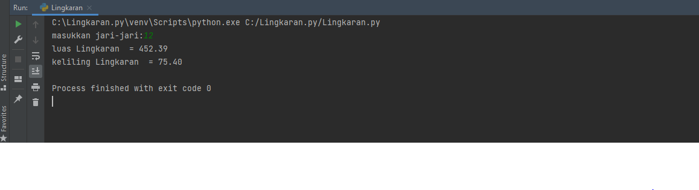

# Labs.2
## Menghitung luas dan keliling Lingkaran menggunakan Python
### Berikut adalah rumus Lingkaran
Luas     = π × r²
Keliling = 2 x π × r
Nilai Phi yang akan kita gunakan adalah 3.14
r merupakan jari-jari lingkaran
Phi merupakan nilai konstanta di matematika sementara jari-jari merupakan jarak antara titik pusat dengan tepi lingkaran. Sebetulnya ada rumus lain untuk menghitung keliling lingkaran yaitu dengan menggunakan diameter, tapi pada kasus ini kita cukup menggunakan jari jari lingkaran saja.
### Berikut adalah flowchart menghitung luas dan keliling Lingkaran

### Selanjutnya menggunakan import math
Untuk kode math.pi menggunakan 3.14, seperti gambar dibawah ini.

### Ini adalah hasil output program menghitung luas dan keliling lingkaran

